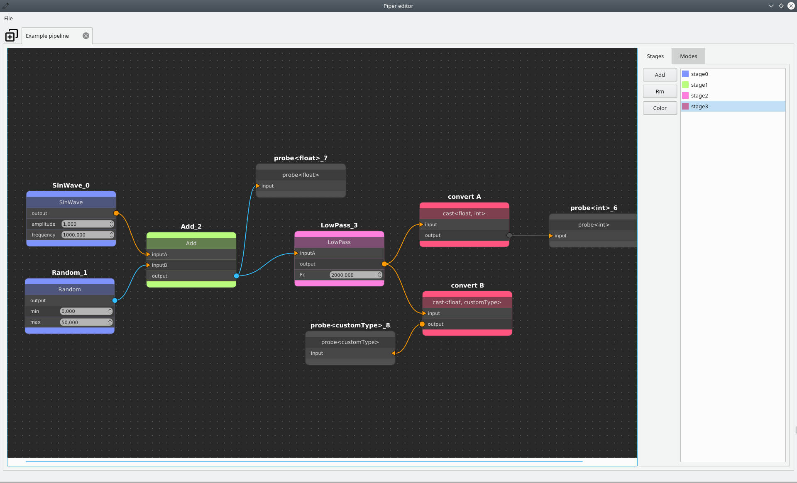

Piper is a C++/Qt5 library that let your easily create and edit nodes based graphs.
Piper is under the CeCILL-C licence.

###
## Requirement
You need Qt5 and CMake 3.10 or higher

###
## Build instructions

cd /your/project/build
cmake ../
make

./editor

###
## Example
main.cc is an example of how to use the Piper library in an application.
Note that the example editor need works to be user friendly (i.e. the only way to create a new node is to press '=' key while the scene has the focus).
